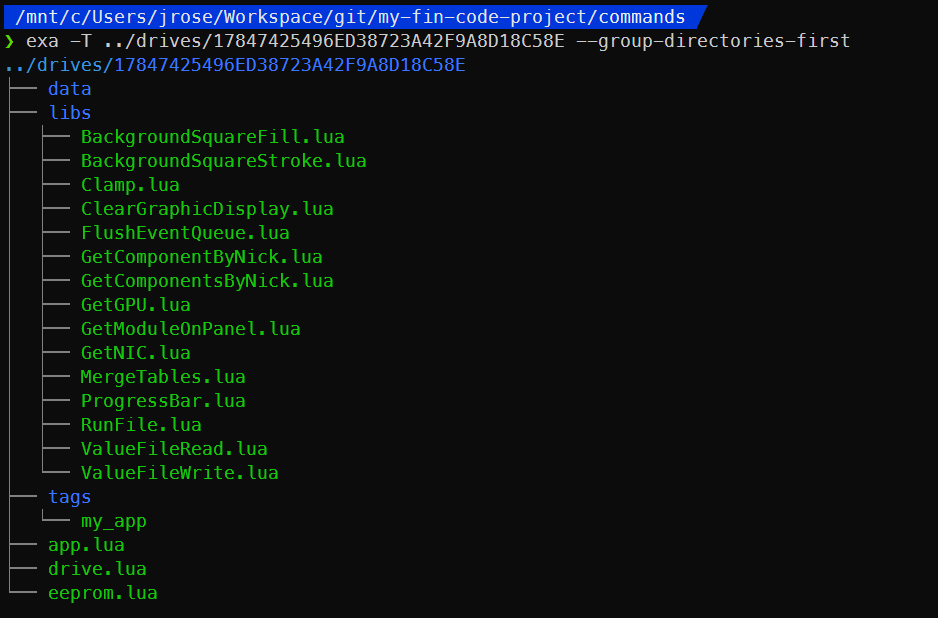

# Anatomy of a Built Drive

[Back to docs index](./README.md)

**IMPORTANT: Don't waste time editing files on drives directly (except for `drive.lua`)! Edit apps and library functions instead, because those will overwrite the files on drives whenever `build` is run and you will lose any changes made to drives directly!**

## [data](#data)

This folder should be used for files that your app will read/write during its execution, typically to store state that you want to persist between app reboots. This might mean something as simple as a set point value or whether a given feature is enabled, which you want the system to remember even if it reboots.

**Any files in this folder will be updated from your Satisfactory folder when you run `push` so the most current in-game values persist after you update any code.**

**When the `pull` or `push` commands are run, any files in this folder will be overwritten from your Satisfactory folder.** This is usually preferable to keep the most current state of data that in-game are are reading/writing after code changes. However, it is possible to pass the `--no-clobber` parameter to both `push` and `pull` to prevent either command from overwriting data at the destination.

## [libs](#libs)

This folder is a copy of the `libs` folder from the root of youy FIN code project. It contains any Lua code files you want to be available *across all of your apps*. `eeprom.lua` runs all files in this folder before running your app.

When the `build` command is run, this folder is overwritten with the latest `libs` folder. Make sure to run `build` after adding or modifying any new library files you may need in your apps.

## [tags](#tags)

This folder is used by the `tag` and `untag` commands to store files that act as identifiers. Each tag is a file and the name of the file is the identifier. These identifiers let you group drives however you like so you can easily look them up. A drive can have any number of identifiers, where each file is named for the identifier it represents.

## [app.lua](#app.lua) (file)

Copied directly from your app. This is your app's entrypoint Lua file.

## [drive.lua](#drive.lua) (file)

This file can be used to set any constants that *only apply to this drive*. For example, an app to monitor a storage container may need to know which material it is intended to store -- each computer would need this value set differently even though they all run the same code.

**When the `build` command is run, this file is added to each drive if it isn't already present but will never overwrite this file if it already exists.**

To use this file, you need to run it from your app yourself (try the [`RunFile`](library.md#runfile) library function).

## [eeprom.lua](#eeprom.lua) (file)

This is the EEPROM code that will bootstrap the drive and run `app.lua`. It uses FIN's virtual filesystem to mount the drive and loads up any library files included on the drive with the build, then starts the app.

When the `build` command is run, the template `eeprom.lua` in the root of your FIN code project is copied into each built drive and each drive's UUID is automatically spliced into the file so when a computer the built `eeprom.lua`, the attached drive will be boot and your app will run.

When setting up a new computer for the first time, copy this into the drive's EEPROM tab.

---

[Back to docs index](./README.md)
