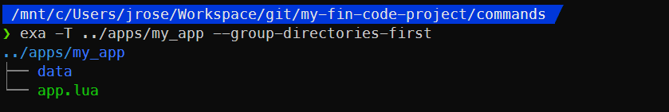

# Anatomy of an App

## [data](#data)

This folder should be used for files that your app will read/write during its execution, typically to store state that you want to persist between app reboots. This might mean something as simple as a set point value or whether a given feature is enabled, which you want the system to remember even if it reboots.

**Making changes to files here will not result in changes to a built drive, even after running the `build` command.** The `build` command will preserve the contents of a drive's `data` folder (as it exists in your Satisfactory data folder) rather than overwrite with the contents of this app `data` folder, so that pushing new code doesn't overwrite application state in-game. However, the app `data` folder will be written to each drive on its first `build`, so you can set up default values for a new computer.

## [app.lua](#applua) (file)

This file is the entrypoint of your app. It gets run by the EEPROM bootloader after the filesystem is mounted and library functions are loaded.

This file defines an `App()` function by default, which it then runs on its final line, but this is only a convention. If you want to rename this function or handle the launch of your app differently, you can. Since `app.lua` is being executed by the bootloader, any code placed in this file will be run, whatever it is.
