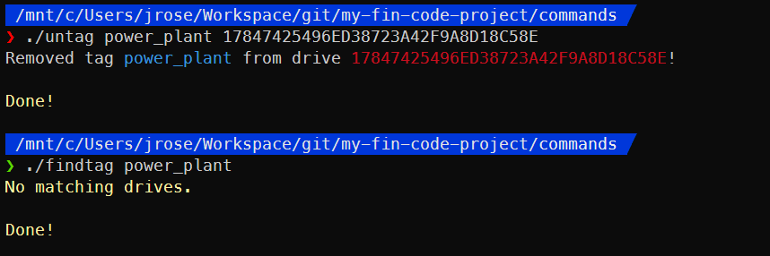

# Commands Reference

[Back to docs index](./README.md)

## Index

- [apply](#apply)
- [build](#build)
- [clean](#clean)
- [discover](#discover)
- [findtag](#findtag)
- [createapp](#createapp)
- [pull](#pull)
- [push](#push)
- [reapply](#reapply)
- [tag](#tag)
- [unapply](#unapply)
- [untag](#untag)

## [apply](#apply)

The `apply` command is used to apply an app to one or more drives.

Once an app is applied to a drive, the `build` command will build this drive whenever a building the applied app (in addition to any other drives to which the app is already applied). This allows the build command to easily be updated across all drives that run the app at once.

A hidden `.app` file is added to the drive to represent this association, and this file contains the name of the app that has been assigned to the drive. This file is used by the `reapply` command when rebuilding the `app_drives` folder. If the `.app` file is modified or deleted, the `build` command may produce unexpected behaviour.

Once an app is applied to a drive, the drive is automatically symlinked into a subfolder of the `app_drives` folder so you can easily track which drives an app is applied to.

If you *do not* want all drives that run an app to be updated (for whatever reason), my recommendation is to make a copy of the app and apply the new app to the drives you *do* want to update when `build` is run.

To safely unassociate an app from a drive, use the [`unapply`](#unapply) command.

[Source code](../commands/apply)

### Syntax

```bash
./commands/apply APP_NAME DRIVE_UUID [DRIVE_UUID]...
```

### Options

None

### Examples


## [build](#build)

The `build` command writes built app files to one or more drives where the app has been applied.

The build process copies all of the following to each drive to be built:

  1. The EEPROM code to bootstrap the app
  2. Any library files containing libraries common to all apps
  3. The app files
  4. `drive.lua` will be created from a template if it doesn't yet exist

The contents of the app's `data` folder will never overwrite the built drive's `data` folder. If the built drive does not yet have these files, they'll still be copied in. This is a feature to allow the in-game data to persist rather than causing builds to trample in-game computer state.Also, if a built drive has a `drive.lua` already it will never be overwritten, so that any drive-specific settings are retained.

Additionally, the `eeprom.lua` template that is copied to each drive automatically has the drive's UUID injected into its code so that the drive will be booted by the bootloader when the computer starts up.

For a deeper dive into the files and folders built drives are made up of, see [the anatomy of a built drive](anatomy_of_a_drive.md).

To apply an app to a drive so `build` will write to that drive, use the [`apply`](#apply) command.

[Source code](../commands/build)

### Syntax

```bash
./commands/build APP_NAME
```

### Options

None

### Examples


We can find the contents of the `my_app` folder here, as well as `eeprom.lua`. For now, everything else isn't that important. For a deeper dive, read the [anatomy of a built drive](anatomy_of_a_drive.md) after you're finished with this.

## [clean](#clean)

Delete the contents of the `backups` folder. Think of this as "emptying the recycle bin" in Windows.

[Source code](../commands/clean)

### Syntax

```bash
./commands/clean
```

### Options

None

### Examples


## [discover](#discover)

***This is a low-level command. There's not much of a reason to run it directly.***

The `discover` command is used by the `push` and `pull` commands to fetch the current state of data files from drives in the Satisfactory computers folder and print out when new drives are discovered (those that don't yet have a folder in the FIN code project).

Ultimately, this command is responsible for actually "pulling" the drives from Satisfactory.

[Source code](../commands/discover)

### Syntax

```bash
./commands/discover [--no-clobber]
```

### Options

`--no-clobber` *(optional)* : Do not overwrite any data files in the Satisfactory computers folder. If a data file exists in the FIN code project but does not in the Satisfactory, the data file will still be created.

### Examples


## [findtag](#findtag)

The `findtag` command can look up identifiers on drives that were added by the `tag` command.

Tagging can be extremely helpful if you want to be able to look up drives spread out over your factory based on more than just which app they run. For example, you might find it helpful to tag drives for which factory they're in. This allows you to easily distinguish where you need to go to reboot computers in-game after an update.

Identifiers are kept in the `tags` folder of each drive. Each identifier is represented by a file that is named for the identifier. A drive can have as many identifiers as you wish and they don't need to conform to any kind of hierarchical arrangement.

To tag a drive with an identifier, use the [`tag`](#tag) command.

[Source code](../commands/findtag)

### Syntax

```bash
./commands/findtag TAG
```

### Options

None

### Examples


## [createapp](#createapp)

The `createapp` command creates a new app in your FIN code project as a subfolder under the `apps` folder.

The new app if created using the `.sdk/templates/app` folder as a template, so if you want your default app to contain specific code or files, you can edit that.that you can edit to do whatever you please. New apps are created into the `apps` folder of your FIN code project.

For a deeper dive into the files and folders apps are made up of, see [the anatomy of an app](anatomy_of_an_app.md).

[Source code](../commands/createapp)

### Syntax

```bash
./commands/createapp APP_NAME
```

### Options

None

### Examples


## [pull](#pull)

The `pull` command fetches all computers from your Satisfactory computers folder and creates them in the `drives` folder of your FIN code project.

This consists of 2 steps:

1. Run the `discover` command to create any newly discovered drives under the `drives` folder
2. Run the `reapply` command to sort any new drives into the "unapplied" group under `app_drives`

By default, this results in the `data` subfolder of all drives being overwritten with whatever is stored in the Satisfactory computers folder at that time. This is generally what you want, since data being actively used in-game should be preserved rather than ovewritten by builds in order to maintain application state of apps as they run in-game.

[Source code](../commands/pull)

### Syntax

```bash
./commands/pull [--no-clobber]
```

### Options

`--no-clobber` *(optional)* : Do not overwrite any data files in the FIN code project. If a data file exists in Satisfactory but does not in the FIN code project, the data file will still be created.

### Examples


## [push](#push)

The `push` command copies your `drives` folder into your Satisfactory computers folder, overwriting any computers there. This is your "deploy" command to actually send code to Satisafactory so it can be run in-game.

Your Satisfactory computers folder will be backed up each time you push, just in case. Check the `backups` folder of your FIN code project if anything goes really wrong.

To clean out the `backups` folder, use the [`clean`](#clean) command.

[Source code](../commands/push)

### Syntax

```bash
./commands/push [--no-clobber]
```

### Options

`--no-clobber` *(optional)* : Do not overwrite any data files in the Satisfactory computers folder. If a data file exists in the FIN code project but does not in the Satisfactory, the data file will still be created.

### Examples


## [reapply](#reapply)

The `reapply` command rebuilds the `app_drives` folder by deleteing it and re-sorting all of the drives into app subfolders using their `.app` files to determine which app applied to each. It is used by the `pull` command to sort newly discovered drives into the "unapplied" group under `app_drives`.

You generally don't need to use this command directly, but it could be helpful if you accidentally delete or break your `app_drives` folder.

[Source code](../commands/reapply)

### Syntax

```bash
./commands/reapply
```

### Options

None

### Examples


## [tag](#tag)

The `tag` command applies an identifier to one or more drives so they can be looked up using the `findtag` command.

Tagging can be extremely helpful if you want to be able to look up drives spread out over your factory based on more than just which app they run. For example, you might find it helpful to tag drives for which factory they're in. This allows you to easily distinguish where you need to go to reboot computers in-game after an update.

Identifiers are kept in the `tags` folder of each drive. Each identifier is represented by a file that is named for the identifier. A drive can have as many identifiers as you wish and they don't need to conform to any kind of hierarchical arrangement.

To look up all drives that have a given tag/identifier, use the [`findtag`](#findtag) command.

To untag a drive from an identifier, use the [`untag`](#untag) command.

[Source code](../commands/tag)

### Syntax

```bash
./commands/tag TAG DRIVE_UUID [DRIVE_UUID]...
```

### Options

None

### Examples


## [unapply](#unapply)

The `unapply` command "un-applies" any app from one or more drives.

That is, the drives are disassociated from the app that was applied and are returned to the "unapplied" group under `app_drives`. This means that when the app that was associated is built using the `build` command, these drives will no longer be written to.

Each drive's `.app` file is set to "unapplied" rather than deleted.

To apply an app to a drive, use the [`apply`](#apply) command.

[Source code](../commands/unapply)

### Syntax

```bash
./commands/unapply DRIVE_UUID [DRIVE_UUID]...
```

### Options

None

### Examples


## [untag](#untag)

The `untag` command "un-tags" one or more drive from an identifier given to it by the `tag` command. That is, the drive is disassociated from the identifier so that the `findtag` command will no longer return these drives when searching for the tag that was removed.

The idenfifier in the `tags` folder of each drive will be removed.

To tag a drive with an identifier, use the [`tag`](#tag) command.

[Source code](../commands/untag)

### Syntax

```bash
./commands/untag TAG DRIVE_UUID [DRIVE_UUID]...
```

### Options

None

### Examples


---

[Back to docs index](./README.md)
