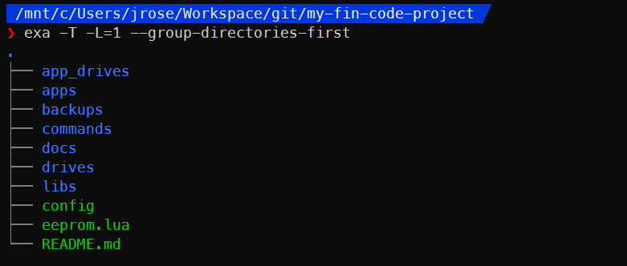

# Folder Structure

[Back to docs index](./README.md)

To help understand all the parts of FINSDK, a top-level overview of the entire folder structure of a FIN project if useful. This overview will carry on from the Getting Started project example, discussing each file/folder in a bit of detail. I'll discuss them in the order that hopefully makes the most sense.

## [app_drives](#app-drives)

The `app_drives` folder provides the easiest way to see which drives an app is applied to.

The `app_drives` folder contains will contain one subfolder for each app which will contain one or more applied drives. These subfolders may be updated any time the `apply`, `unapply` or `reapply` commands are run.

The drive "folders" grouped by app here are actually symlinks that point to the `drives` folder, where the *real* drive files exist. Whenever changes are made to these files, the real drive folder will be updated as well, because they point to the same set of files.

## [apps](#apps)

The `apps` folder contains 1 folder for each app in your FIN code project. Each app can be built to one or more drives at a time, so think of apps as templates for code behaviour. This relationship between apps and drives makes the app the *source of truth* about behaviour for the drives it is applied to.

**When editing an app's behaviour, edit it here (not the drive itself) because drives are overwritten using the app folder as the source of truth.**

For a deeper dive, see [the anatomy of an app](anatomy_of_an_app.md).

## [backups](#backups)

Each time the `push` command is run, it overwrites the contents of your Satisfactory data folder. However, the contents of that folder are automatically backed up to this folder in timestamped folders so it is always possible to recover anything that is lost.

Expect to clean this folder out occasionally. You can use the `clean` command to empty this folder whenever it gets too large.

This folder is automatically ignored in git via `.gitignore`.

## [commands](#commands)

The `commands` folder contains all of the bash commands that you will use to build and deploy code as well as manage and organize your apps. You shouldn't need to edit this folder unless you mean to customize the behaviour of FINSDK itself.

## [docs](#docs)

The `docs` folder contains the documentation you're currently reading.

## [drives](#drives)

**Don't waste time editing files on drives directly! Edit `apps` and `libs` instead, because those will overwrite the files on drives whenever `build` is run and you will lose changes made to drives directly!**

The `drives` folder contains all of your FIN drives, and therefore all of your built code. When you run the `pull` command to fetch drives from Satisfactory, those drives are added here. When you run the `build` command, some or all `drives` subfolders (those that the app being built is applied to) will be updated with the latest built code. When you run the `push` command, your Satisfactory computers folder is updated to match the contents of this folder *exactly*.

This folder will reflect your code *exactly as it will be run on FIN computers*.

For a deeper dive, see [the anatomy of a built drive](anatomy_of_a_drive.md).

## [libs](#libs)

The `libs` folder contains Lua code files that will be automatically packaged into the build of *every* drive. This allows you to build a library of common functions/files to reduce code duplication between and increase consistency accross your apps. Some of my own functions have been included here as examples. Feel free to use, modify, replace and/or delete them as you see fit.

## [config](#config) (file)

The main config file used by all of the FINSDK bash commands.

**This file must be edited to add your Satisfactory data path in order for FINSDK commands to work.**

## [eeprom.lua](#eeprom.lua) (file)

This file is a *template* for the EEPROM code that runs the app deployed to a computer. It acts as a bootloader to bootstrap the filesystem and mount any drives connected to the computer then ultimately run the app.

Unless you intend to edit the bootloading behaviour, there's not much reason to edit this file.

When the `build` command run, `eeprom.lua` is copied into each drive that is built. The value of `__DRIVE_UUID__` will be replaced by the drive's actual UUID in each case.

## [README.md](#README.md) (file)

Feel free to modify README.md to document your own project.

---

[Back to docs index](./README.md)
