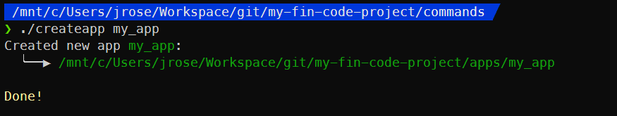
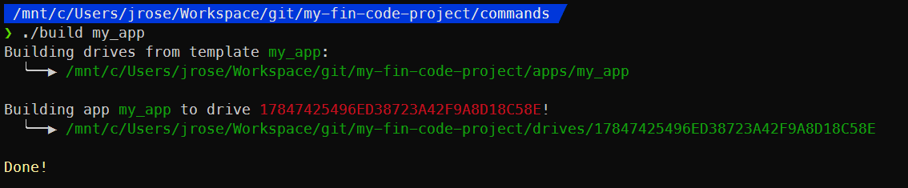

# Getting Started

[Back to docs index](./README.md)

## [Before you start...](#before-you-start)

This SDK takes advantage of the vitual filesystems feature of FIN to edit code in-game. In-game storage media such as floppy disks and HDDs each have a virtual filesystem that maps to a folder in your OS filesystem. **We will refer to these in-game storage media as "drives".**

**Drives are actual in-game objects.** They can be constructed at a workbench like anything else in Satisfactory. You  won't need enough of them to automate their production, so don't worry about that. There is no difference between floppy disks and HDDs in FIN at the moment, so I recommend only making floppies, since every FIN computer allows you to insert a floppy without building any additional parts. It's just easier.

**In this SDK, you will be most often be developing "apps". Each "app" represents a program that can run on a computer. Each app can be deployed to one or more drives. Each drive is inserted into an in-game FIN computer, which runs the app on the drive.**

**In this guide, you will be creating a new app and running it on a single computer to show you each step of the process.**

With that out of the way, let's begin...

## [Build a FIN computer](#build-a-fin-computer)

If you aren't already a FIN developer, I **strongly recommend** watching [this short video](https://www.youtube.com/watch?v=EtybEOkgJ4o) to get a rough idea of what FIN can do and how to build a FIN computer.

*If you've already built a computer and installed a floppy disk, skip ahead to the next section.*

Make sure you have the Ficsit-Networks mod installed and run Satisfactory.

Go to your Factory Hub and unlock both `Basic Networks` and `Modular I/O`. You'll need something like 450 Crystal Oscillators to unlock these and build the parts below, so prepare for that!

1. Construct a Computer Case
2. Construct a T1 CPU inside the Computer Case
3. Construct a T1 RAM inside the Computer Case
4. Build a Lua EEPROM at a workbench and install it into the computer
5. Build a Floppy Disk at a workbench and install it into the computer

**Before diving into FINSDK, you should get comfortable with building computers in-game and running some small programs first!**

## [Installing and configuring FINSDK](#installing-and-configuring-finsdk)

Clone this repo to your computer and immediately make a copy of it. The copy will be your FIN code project, so feel free to make your own git repo to version it. Having a copy makes it easy to pull the latest version of this repo to get updates while also versioning your FIN code separately.

```bash
git clone https://github.com/DigitalMachinist/satisfactory-fin-sdk.git
cp -r satisfactory-fin-sdk my-fin-code-project
rm -rf ./my-fin-code-project/.git
```

Find the path to your Satisfactory data folder. Under Windows, it should be something like:

```bash
C:\Users\{YOUR_USERNAME}\AppData\Local\FactoryGame
```

**However, we need that path in the form that your bash terminal would display it. Leave out any trailing slashes.** For my WSL zsh terminal, that looks like this:

```bash
/mnt/c/Users/{YOUR_USERNAME}/AppData/Local/FactoryGame
```

Open the `config` file from the root folder of your FIN code project in your editor.

```bash
cd my-fin-code-project
edit config
```

Modify `SATISFACTORY_DATA_PATH="YOUR_PATH_GOES_HERE"` so your Satisfactory data path is inside the double-quotes.


If your editor runs on a Windows filesystem (rather than the filesystem bash runs in) you should keep `SYMLINK_FOR_WINDOWS=1` but if you run a *nix editor like `vim`/`emacs`/`nano` that runs within the same filesystem as bash, set `SYMLINK_FOR_WINDOWS=0`.

## [Pulling computers into your FIN code project](#pulling-computers-into-your-fin-code-project)

Run Satisafactory and load your game.

Change directory to the `commands` directory and run the `pull` command. We're going to be running lots of commands, so it's convenient to be in this folder. However, you can run commands from any working directory should you need to.

```bash
cd commands
./pull
```

The output should look like this if everything went well (although the drive UUID you see will definitely not be the same):


The `pull` command fetches all computers from your Satisfactory computers folder and created them in the `drives` folder of your FIN code project. *Note: the Satisfactory computers folder only contains computers from the currently loaded save file!*

A new drive folder should have appeared in your `drives` folder now:


## [Creating an app](#creating-an-app)

To create a new app, run the `createapp` command. This creates a new app from a template that you can edit to do whatever you please. New apps are created into the `apps` folder of your FIN code project.

```bash
./createapp my_app
```



Let's take a quick look at what `my_app` contains:


`app.lua` is the entrypoint of your app and is where any Lua code you write should go. We can ignore the `data` folder for now, but for more information read the [anatomy of an app](anatomy_of_an_app.md) after you're finished with this.

We should take a look at what `app.lua` does:


`app.lua` defines the `App()` function and immediately calls it. When `app.lua` is run by the bootloader, `App()` will run any code you write here.

Also, just to show that you can write your own functions, this template `app.lua` calls down to the `PrintTest()` function which will print "App code ran!" to the FIN computer's in-game terminal when this runs to confirm that the app actually executed.

## [Applying and building apps](#applying-and-building-apps)

The `apply` command is used to apply an app to a drive. Once an app is applied to a drive and the `build` command is run, the app is built to that drive. In this way, an app can be applied to many drives so that whenever the app is built, many drives are updated with the same code.

```bash
# ./apply my_app <drive_uuid>
./apply my_app 17847425496ED38723A42F9A8D18C58E
```


Once an app is applied to a drive, the drive is automatically symlinked into a subfolder of the `app_drives` folder so you can easily track which drives an app is applied to.


In my editor, the contents of the drive are displayed here as well (following the symlink). Since the symlink points to `./drives/<drive_uuid>`, any changes made here are reflected in both folders automatically.


We can now run the `build` command to write a build of `my_app` to the drive.

```bash
./build my_app
```

This gathers up:

  1. The EEPROM code to bootstrap the app
  2. Any library files containing libraries common to all apps
  3. The app files
  
...then it writes them all to every drive the app is applied to.

In this case, just one:



We can find the contents of the `my_app` folder here, as well as `eeprom.lua`. For now, everything else isn't that important. For a deeper dive, read the [anatomy of a built drive](anatomy_of_a_drive.md) after you're finished with this.


At this point, the drive contains everything it needs to run in-game. We just need to push it back into Satisfactory!

## [Pushing drives into Satisfactory](#pushing-drives-into-Satisfactory)

The `push` command copies your `drives` folder into your Satisfactory computers folder, overwriting any computers there.

```bash
./push
```


Your Satisfactory computers folder will be backed up each time you push, just in case. Check the `backups` folder of your FIN code project if anything goes really wrong. You'll want to empty this folder out periodically using the `clean` command.

## [Running your code in Satisfactory](#running-your-code-in-satisfactory)

Alt-Tab back to Satisfactory and open up your FIN computer interface to the EEPROM tab. You'll notice that there's still no code. Since EEPROMs don't have a virtual filesystem, we need to copy in the contents of your drive's `eeprom.lua` into the EEPROM code field.

**TODO: Image of empty EEPROM code**

Once this has been pasted in, you shouldn't have to modify it anymore. Each drive's `eeprom.lua` is automatically configured but the `build` command to boot the app applied to the drive, so make sure you copy in the `eeprom.lua` for the drive that's inserted into that computer.

In my case, this is:

```bash
drives/17847425496ED38723A42F9A8D18C58E/eeprom.lua
or
app_drives/my_app/17847425496ED38723A42F9A8D18C58E/eeprom.lua
```

**TODO: Image of EEPROM code pasted in**

Hit the power button on your computer to start it up! Along with some EEPROM bootup messages, you should see your computer print out "App code ran!".

**TODO: Image of terminal printing stuff**

Congrats! You have a working computer!

## [Iterate](#iterate)

From this point forward, you can just keep iterating by editing your app code, `build`ing, `push`ing & testing it in-game until it's doing what you need. No further need to manually copy any code.

```bash
# Edit my_app code...
./build my_app
./push
# Test your code & repeat!
```

**To review, this is the basic app development flow:**

1. Build a FIN computer and put a floppy in it
2. Modify app code in your editor
3. Push new code to any floppy drives that run it
4. Reboot the in-game computer to run your new code
5. Repeat 2-4 until your code does what you want it to!

Once you have a working app that you want to scale out to a bunch more computers, you'll need to build those computers and copy EEPROM code to each one. Create a floppies and insert one into each computer. Apply your app to all of these floppies and when you build/push your app, they'll all run your app code as well. Any update you make to the app code will be applied to all drives at once.

---

[Back to docs index](./README.md)
